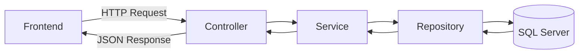

Model: ChatGPT

I’ll explain everything from the ground up.

------

# **1. What is an API?**

API stands for **Application Programming Interface**.

The name sounds intimidating, but the idea is simple:

An API is a set of rules that lets two software applications communicate with each other.

Think of it as a **waiter in a restaurant**.

```
Customer  --->  Waiter(API)  --->  Kitchen(Server)
                 <---
```

The customer doesn’t enter the kitchen.

Instead:

- Customer requests food.
- Waiter delivers the request.
- Kitchen prepares it.
- Waiter returns the food.

A Web API works exactly the same.

```
Browser
Mobile App
Frontend
Postman
       |
       | HTTP Request
       V
ASP.NET Core Web API
       |
Business Logic
       |
Database
```

For example:

The frontend wants to log in.

It sends:

```
POST /api/auth/login
```

with

```json
{
    "email": "john@test.com",
    "password": "123456"
}
```

The backend checks the database and returns

```json
{
    "token": "...",
    "userName": "John"
}
```

The frontend doesn’t know SQL.

It doesn’t know Entity Framework.

It only knows

“I send this request and receive this response.”

That is the API.

------

# **2. What is ASP.NET Core Web API?**

Now imagine the API is the **rules**.

ASP.NET Core Web API is **Microsoft’s framework for building APIs using C#**.

Instead of writing

- HTTP parser
- routing
- authentication
- serialization
- dependency injection
- middleware

yourself…

ASP.NET Core already provides all of that.

So your job becomes writing business logic.

For example

```
User clicks Login

↓

HTTP POST

↓

AuthController

↓

AuthService

↓

UserRepository

↓

SQL Server

↓

UserRepository

↓

AuthService

↓

Controller

↓

JSON Response
```

ASP.NET Core handles everything around that flow.

------

# **3. What is the backend actually doing?**

Imagine your reservation system.

The frontend says

“Show me all organizations.”

Backend:

```
Receive HTTP request

↓

Validate request

↓

Ask service

↓

Service asks repository

↓

Repository queries SQL Server

↓

Return entities

↓

Convert to DTO

↓

Return JSON
```

Every request follows almost this exact pattern.

------

# **4. Understanding your project structure**

Let’s go folder by folder.

------

## **Program.cs**

The entry point.

Equivalent to

```csharp
static void Main()
```

for a console app.

Here ASP.NET starts the web server.

Registers services.

Configures middleware.

Maps controllers.

Starts listening for requests.

Everything begins here.

------

## **Controllers**

Controllers are the **entry points** of your application.

Every HTTP request reaches a controller first.

Example

```
POST /auth/login
```

↓

```
AuthController
```

Example

```csharp
public class AuthController : ControllerBase
{
    public IActionResult Login(...)
    {
    }
}
```

A controller should be very thin.

It shouldn’t contain business logic.

Instead

```
Controller

↓

Service

↓

Repository
```

Think:

Controller = Receptionist.

------

## **Services**

Services contain the application’s business logic.

Example

```
Can this user reserve?

Can this organization approve appointments?

Calculate dashboard statistics.

Send email.

Generate JWT.

Hash password.
```

All these decisions belong inside services.

Example

```csharp
public class AuthService
{
    public TokenResponse Login(...)
    {
        ...
    }
}
```

Think:

Service = The brain.

------

## **Repositories**

Repositories communicate with the database.

They know SQL (or Entity Framework).

Nothing else.

Example

```csharp
GetUserByEmail()

CreateAppointment()

DeleteReview()
```

Repository should NOT decide

“Can this user login?”

It simply returns data.

Think:

Repository = Database translator.

------

## **Models**

Your project divides models into two groups.

------

### **Entities**

These represent your database tables.

Example

```csharp
User

Organization

Appointment

Review
```

If SQL Server has

```
Users
```

there is usually

```csharp
class User
```

Entities are used internally.

------

### **DTOs**

DTO means

Data Transfer Object.

A DTO is **not** a database table.

It is simply the data you want to send or receive.

Example

Database

```
User

Id
PasswordHash
Email
CreatedDate
```

Should the frontend receive PasswordHash?

No.

Instead

```csharp
UserProfileDto
{
    Name
    Email
}
```

DTO protects internal data.

------

Example login

Request DTO

```csharp
LoginRequest
{
    Email
    Password
}
```

Response DTO

```csharp
TokenResponse
{
    Token
    Expiration
}
```

------

## **Data**

Contains the database configuration.

Most importantly

```
AppContext
```

This inherits from

```csharp
DbContext
```

Entity Framework uses it to know

- tables
- relationships
- migrations

------

## **Migrations**

Migrations are version history for the database.

Example

```
Migration 1

Create Users table

Migration 2

Add PhoneNumber

Migration 3

Create Reviews
```

Instead of manually editing SQL,

Entity Framework generates migration files.

------

## **Constants**

Stores fixed values.

Example

```csharp
public static class Roles
{
    public const string Admin = "Admin";
}
```

Instead of

```csharp
if(role=="Admin")
```

write

```csharp
if(role==Roles.Admin)
```

Avoids typos.

------

## **Middlewares**

Middleware runs **before or after every request**.

Pipeline:

```
Request

↓

Logging

↓

Authentication

↓

Exception handling

↓

Controller

↓

Response
```

Your project has

```
ExceptionHandlingMiddleware
```

Instead of every controller writing

```csharp
try
{
}
catch
{
}
```

one middleware catches all exceptions.

------

## **Extensions**

Extension methods.

Mostly used to organize setup code.

Instead of

```csharp
builder.Services.Add...

builder.Services.Add...

builder.Services.Add...
```

Program.cs stays clean

```csharp
builder.Services.AddApplicationServices();
```

------

## **Interfaces**

Example

```
IUserService

IUserRepository
```

These define contracts.

Example

```csharp
public interface IUserRepository
{
    User GetById(int id);
}
```

Implementation

```csharp
public class UserRepository : IUserRepository
{
}
```

Benefits

- loose coupling
- testing
- dependency injection

------

## **appsettings.json**

Application configuration.

Examples

```
Connection String

JWT Secret

SMTP

Logging

Allowed Hosts
```

Never hardcode these.

------

## **launchSettings.json**

Only for development.

Defines

- URLs
- ports
- launch browser
- environment

Not used in production.

------

## **.http**

Very useful.

Lets you test API requests directly from Visual Studio.

Example

```
GET https://localhost:5001/api/users
```

Like a tiny built-in API tester.

------

## **bin**

Compiled output.

Ignore it.

------

## **obj**

Temporary build files.

Ignore it.

------

## **.csproj**

Project configuration.

Contains

- target framework
- NuGet packages
- project settings

------

## **.sln**

Solution file.

Groups one or more C# projects together.

------

# **5. The request lifecycle**

This is the most important picture to remember.

```
Frontend

↓

HTTP Request

↓

Program.cs

↓

Middleware

↓

Controller

↓

Service

↓

Repository

↓

Entity Framework

↓

SQL Server

↑

Repository

↑

Service

↑

DTO

↑

Controller

↑

JSON Response

↑

Frontend
```

Once you understand this flow, the folder structure starts to feel natural.

------

# **6. Mental model for each layer**

| **Layer**  | **Responsibility**                                | **Knows about**              |
| ---------- | ------------------------------------------------- | ---------------------------- |
| Controller | Receives HTTP requests and returns HTTP responses | Services                     |
| Service    | Business rules and application logic              | Repositories, DTOs, Entities |
| Repository | Reads and writes data                             | Database and Entities        |
| Entity     | Represents database data                          | Database schema              |
| DTO        | Represents data sent between client and server    | API contract                 |
| Middleware | Cross-cutting processing for every request        | HTTP pipeline                |
| Program.cs | Configures and starts the application             | Everything during startup    |

### Mermaid diagram



------

## **Where to focus first**

Given your background, I’d recommend learning in this order:

1. **HTTP fundamentals** (GET, POST, PUT, DELETE, status codes, JSON).
2. **ASP.NET Core request pipeline** (how a request reaches a controller).
3. **Controllers and routing** (how endpoints are exposed).
4. **Dependency Injection** (how controllers receive services without creating them).
5. **Entity Framework Core** (working with the database through `DbContext` and repositories).
6. **Authentication and JWT** (how users log in securely).

Those six topics will give you a solid foundation for understanding and contributing to your backend project.