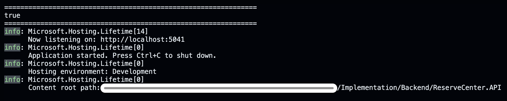

# ReserveCenter | رزروسنتر

> An online appointment-booking and service-business management platform.  
> سامانه‌ای برای رزرو آنلاین نوبت و مدیریت کسب‌وکارهای خدماتی.


**Live site:** [rsvcenter.ir](https://rsvcenter.ir/)  
**Second Address:** [here](https://reservecenter.csharpers.workers.dev/)  

## Overview | معرفی

ReserveCenter helps customers find service businesses and book appointments, while giving business teams and platform administrators the tools to manage their operations.  
رزروسنتر به مشتریان کمک می‌کند کسب‌وکارهای خدماتی را پیدا کنند و نوبت بگیرند؛ همچنین ابزارهای لازم برای مدیریت کسب‌وکار و مدیریت سامانه را فراهم می‌کند.

## Highlights | قابلیت‌های کلیدی

- **Authentication & roles:** registration, login, password recovery, role selection, JWT creation.  
  **احراز هویت و نقش‌ها:**  ثبت‌نام، ورود، بازیابی رمز عبور، انتخاب نقش و تولید توکن احراز هویت
- **Business management:** organisation registration, profiles, services, staff, and appointment workflows.  
  **مدیریت کسب‌وکار:** ثبت سازمان، پروفایل، خدمات، کارکنان و فرایند نوبت‌ها.
- **Customer experience:** business discovery, search, public profiles, booking, and appointment tracking.  
  **تجربه مشتری:** جست‌وجو، پروفایل عمومی، رزرو، و پیگیری نوبت.
- **Dashboards & administration:** organisation dashboards plus user, advertisement, organisation administration, and new organisation request management.  
  **داشبورد و مدیریت:** داشبوردهای سازمانی و مدیریت کاربران، تبلیغات و کسب‌وکارها، مدیریت درخواست ثبت کسب‌وکارهای تازه.

## Project Completion Note | یادداشت تکمیل پروژه

This repository contains the completed implementation and supporting deliverables for an academic course project. It is a project handoff, not a claim of production readiness.  
این مخزن شامل پیاده‌سازی تکمیل‌شده و خروجی‌های پشتیبان یک پروژه درسی است و ادعای آماده‌بودن برای محیط عملیاتی ندارد.

- **Team members (5):** Sajad, Abolfazl, Ali, Hamed, Mohammad Hossein
- **Course / institution:** System Analysis and Design | تحلیل و طراحی سیستم‌ها
- **Submission date / version:** 28 Tir 1405 | July 19 2026

## Code Statistics | آمار کد
Last update: July 26 2026

| Language | Files | Lines |
| --- | ---: | ---: |
| HTML | 30 | 4,347 |
| CSS | 25 | 12,586 |
| JavaScript | 22 | 6,619 |
| C# | 141 | 8,197 |

Counts cover source files under `Implementation/` and exclude generated/build output such as `bin/`, `obj/`, and dependencies.  
این آمار فقط فایل‌های منبع در `Implementation/` را شامل می‌شود و خروجی‌های تولیدشده مانند `bin/`، `obj/` و وابستگی‌ها را در نظر نمی‌گیرد.

## Repository Structure | ساختار مخزن

```text
.
├── Implementation/          Application source and delivery assets
│   ├── Frontend/            Static HTML, CSS, JavaScript, shared components, and assets
│   ├── Backend/             .NET 9 Web API, controllers, services, repositories, and DTOs
│   └── Database/            Database backup used by the project
├── Documentation/           Complete analysis, requirements, planning, and team deliverables
├── Design/                  Database schema and website design diagrams
├── Knowledge/               Team reference material and technical notes
└── README.md                This project overview and completion note
```

- `Implementation/Frontend/` is the Cloudflare-hosted user interface.
- `Implementation/Backend/ReserveCenter.API/` is the C# API; it follows controller, service, repository, model/DTO, and database-model layers.
- `Implementation/Database` contains the latest backup of database used in SSMS to restore database on local MS SQL server.
- `Documentation/` is the source of truth for the detailed project documentation; this README intentionally stays brief.
- `Design/DatabaseSchema_Final.svg` provides the final database-schema visual.

## Project Documentation | مستندات پروژه

For requirements, analysis, plans, meeting notes, and project artefacts, start in [Documentation/](Documentation/). Backend-specific development guidance is available in [Implementation/Backend/guide/](Implementation/Backend/guide/), and frontend planning notes are in [Implementation/Frontend/guide/](Implementation/Frontend/guide/).

## System Proposal | پروپوزال سیستم
This document was made in a different plance and it's kept in our repository.  
این مستند در جای دیگری درست شده است و در مخزن ما نگهداری نمی‌شود.

## CSharpers Team Members
This project is done by a team of five.  
این پروژه توسط تیم پنج‌نفره انجام شده‌است.

- [Sajad Sabaghkermani](https://github.com/TnT74K) -- Project Lead
- [Abolfazl Vaziri](https://github.com/AbolfazlVaziri1384) -- Database Lead
- [Ali Adib Razavi](https://github.com/AliRz01) -- Frontend Lead
- [Hamed Yazdizadeh](https://github.com/hamed-yazdi9772) -- Backend Lead
- [Mohammad Hossein Zarei](https://github.com/mohamad-hosein-iren) -- FE-BE Integration Lead

## Setup Instructions | دستورالعمل راه‌اندازی

### English

> [!IMPORTANT]
>
> We assume you are using **macOS** or **Windows** with **.NET 9** (or later) installed.
>
> You will also need access to **Microsoft SQL Server 2022** (or a newer version).
>
> If you are using **macOS**, configure your connection string to point to an **MSSQL Server** instance running on a **Windows** machine within your local network.
>
> You should also have **Visual Studio Code** (or another IDE/editor that supports the **Live Server** extension) installed.

1. Restore all NuGet packages required by the solution.

2. Set up your own **Microsoft SQL Server** environment and ensure your system **firewall** allows **MSSQL Server** traffic.
   - If you are using **macOS**, make sure your **MSSQL Server** is running on a **Windows** machine that is accessible from your Mac over the local network.

3. Restore the database backup located in `Implementation/Database` to your SQL Server instance.

4. Clone or download this repository to your local machine.

5. Set up the **ASP.NET Core Web API** development environment.

6. Create an `appsettings.Development.json` file inside `Implementation/Backend/ReserveCenter.API/`, then add your own SQL Server **connection string** so the backend can connect to the restored database.

7. Install the **Live Server** extension for VS Code.

8. Open a terminal and navigate to `Implementation/Backend/ReserveCenter.API/` using the `cd` command.

9. Start the backend by running:

   ```bash
   dotnet run
   ```

   - Wait a few moments for the application to finish starting.
   - If everything is configured correctly, you should see output similar to the following:

     

   - If the first line displays `false`, the backend could not connect to your **MSSQL Server**. Double-check your connection string and ensure the database server is running.
   - Also verify the address shown after `http://localhost:`. For the frontend to work correctly, the port should be **5041**.

10. Open `index.html` using **Live Server**.

11. You're all set—enjoy exploring the project!

### فارسی

> [!IMPORTANT]
>
> فرض می‌کنیم که **macOS** یا **Windows** را به همراه **.NET 9** یا نسخه‌های جدیدتر نصب کرده‌اید.
>
> همچنین به یک **Microsoft SQL Server 2022** یا نسخه‌های جدیدتر دسترسی دارید.
>
> اگر از **macOS** استفاده می‌کنید، باید رشته اتصال (Connection String) را به یک پایگاه داده **MSSQL** که روی یک رایانه **Windows** در شبکه محلی شما اجرا می‌شود، تنظیم کنید.
>
> همچنین باید **Visual Studio Code** (یا هر محیط توسعه‌ای که از افزونه **Live Server** پشتیبانی می‌کند) را برای اجرای پروژه نصب کرده باشید.

۱. پکیج‌های موردنیاز Solution را نصب (Restore) کنید.

۲. محیط **Microsoft SQL Server** خود را راه‌اندازی کرده و اطمینان حاصل کنید که **Firewall** سیستم، ترافیک مربوط به **MSSQL Server** را مجاز می‌داند.
   - اگر از **macOS** استفاده می‌کنید، مطمئن شوید یک **MSSQL Server** روی یک رایانه **Windows** در شبکه محلی شما در حال اجرا است و از طریق مک قابل دسترسی است.

۳. فایل پشتیبان پایگاه داده موجود در مسیر `Implementation/Database` را روی SQL Server خود بازیابی (Restore) کنید.

۴. این مخزن (Repository) را روی سیستم خود دانلود یا Clone کنید.

۵. محیط اجرای **ASP.NET Core Web API** را آماده کنید.

۶. در مسیر `Implementation/Backend/ReserveCenter.API/` فایلی با نام `appsettings.Development.json` ایجاد کرده و **رشته اتصال (Connection String)** مربوط به SQL Server خود را در آن قرار دهید تا Backend بتواند به پایگاه داده بازیابی‌شده متصل شود.

۷. افزونه **Live Server** را در VS Code نصب کنید.

۸. با استفاده از دستور `cd` وارد مسیر `Implementation/Backend/ReserveCenter.API/` شوید.

۹. با اجرای دستور `dotnet run`، Backend را اجرا کنید.
   - چند لحظه صبر کنید تا برنامه به‌طور کامل راه‌اندازی شود.
   - در صورت اجرای موفق، خروجی‌ای مشابه تصویر زیر مشاهده خواهید کرد:
   - 
   - اگر در ابتدای خروجی مقدار `false` نمایش داده شد، به این معنی است که Backend نتوانسته به **MSSQL Server** متصل شود. در این صورت، رشته اتصال (Connection String) خود را دوباره بررسی کنید.
   - همچنین به شماره پورتی که بعد از `http://localhost:` نمایش داده می‌شود توجه کنید. برای عملکرد صحیح صفحات Frontend، این پورت باید `5041` باشد.

۱۰. فایل `index.html` را با استفاده از **Live Server** اجرا کنید.

۱۱. از پروژه استفاده کنید و آن را بررسی کنید!

---
Proudly made by CSharpers Team
